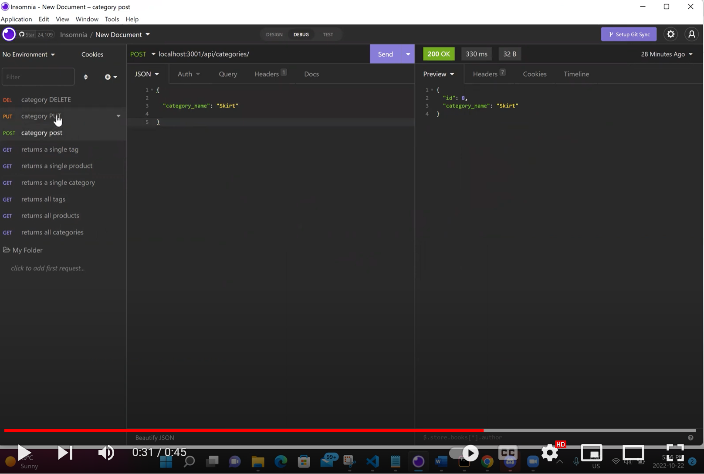
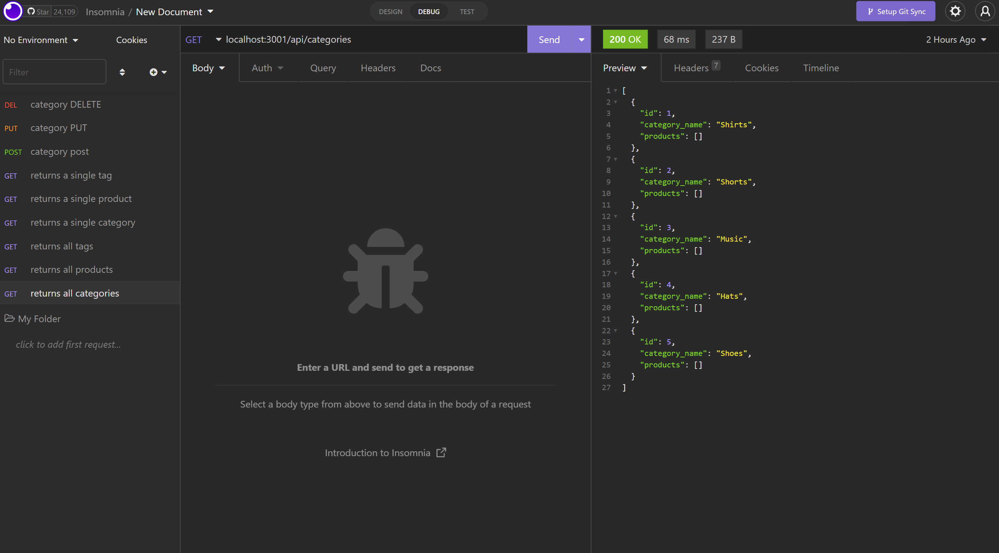

# Ezee Commerce
 ## Demo
  - You can click on either the image or this link to access the video https://www.youtube.com/watch?v=9ZIUlCNxBqo&ab_channel=EsraAl-Abduljabar
 

## Description
This E-commerce backend node.js application utilizes express.js server and an SQL database. This RESTful APIs executes CRUD operations. This application uses sequelize to convert data to and from the database. Insomnia was used to demonstrate functionality when executing requests.
## features
- Ability to select actions such as viewing all employees, roles, and department.
- Ability to add roles, employees, departments, and update them.
- Ability to return department budget through sum property.
## Technologies Used
- javascript: to add functionality.
- Node.js: to run javaScript in the Backend (Environment).
- mySQL: to create and reference tables in database.
- Sequelize: ORM tool to convert data to and from the database.

## CLI Application Image

## Installation
### Clone code to your local machine and execute the following commands.
- npm install
- mysql -uroot -p and enter your password
- source db/scheema.sql; and source db/seeds.index.js;
- quit 
- node server.js
